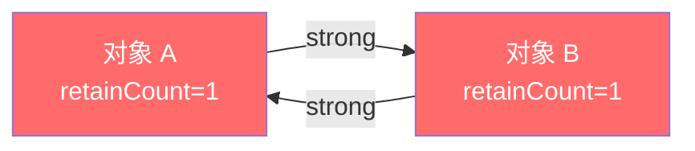
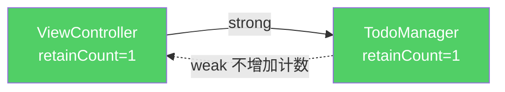

# 第二课：内存管理 — iOS 和 Web 最大的差异

> 这是 iOS 开发中最核心的知识点。Web 开发者很少关心内存，但在 OC 里你必须理解它。

---

## 1. 为什么 Web 不用关心内存，但 OC 要？

| | JavaScript | Objective-C |
|--|-----------|-------------|
| 内存管理方式 | **垃圾回收（GC）** — 引擎自动扫描、自动清理 | **引用计数（Reference Counting）** — 你来管谁活谁死 |
| 开发者需要做什么 | 几乎不用管 | 必须理解 strong/weak/copy |
| 内存泄漏常见吗 | 少见（除非闭包引用 DOM） | 常见（循环引用是大坑） |

**一句话理解：**
- JS：有专人打扫卫生，你不用管
- OC：没有清洁工，你得自己记住"谁在用这个东西"，没人用了就扔掉

## 2. 引用计数（Reference Counting）原理

每个 OC 对象都有一个隐藏的计数器，叫 **retainCount**（引用计数）：

| 操作 | 计数变化 | 触发时机 |
|------|---------|---------|
| 创建对象 `alloc/init` | → 1 | 对象诞生 |
| 强引用指向它 `strong` | +1 | 有人"持有"它 |
| 强引用移除 | -1 | 有人"放手" |
| 计数变为 0 | 💀 销毁 | 没人要了，释放内存 |

```objc
// 伪代码演示引用计数的变化过程
NSObject *obj = [[NSObject alloc] init]; // retainCount = 1（创建）
NSObject *obj2 = obj;                    // retainCount = 2（obj2 也持有）
obj2 = nil;                              // retainCount = 1（obj2 放手了）
obj = nil;                               // retainCount = 0 → 对象被销毁 💀
```

## 3. ARC — 编译器帮你数引用

早期 OC 开发者需要手动写 `retain`（+1）和 `release`（-1），非常容易出错。
2011 年 Apple 引入了 **ARC（Automatic Reference Counting）**——自动引用计数。

**ARC 做了什么？**
- 编译器在编译时自动插入 `retain` 和 `release`
- 你不用手动写，但你必须**告诉编译器每个引用的"强度"**

**Web 类比：**
- 手动管理内存（MRC）≈ 手写 DOM 操作（`createElement` / `removeChild`）
- ARC ≈ React 的虚拟 DOM（框架帮你管，但你要告诉它 state 和 props）
- GC ≈ 全自动（JS 引擎连 state 都帮你清理）

**关键认知：ARC ≠ 垃圾回收。** ARC 是编译期的自动化，GC 是运行期的自动化。ARC 更快但不能解决循环引用。

## 4. strong / weak / copy — 三种引用强度

这是你每天都会用到的三个关键字。

### 4.1 strong（强引用）—— "我拥有你"

```objc
@property (nonatomic, strong) NSMutableArray *todoList;
```

- 只要我持有你，你就不会被销毁
- **默认值**：对象属性不写的话就是 strong
- 类似 JS 的普通赋值：`this.todoList = someArray`

### 4.2 weak（弱引用）—— "我只是看看，你随时可以走"

```objc
@property (nonatomic, weak) id<UITableViewDelegate> delegate;
```

- 我引用你，但不增加你的引用计数
- 当你被销毁时，我会自动变成 `nil`（不会野指针）
- **核心用途：打破循环引用**

**Web 类比：**
```javascript
// JS 的 WeakRef（ES2021）就是这个概念
const weakRef = new WeakRef(someObject);
// someObject 被 GC 回收后，weakRef.deref() 返回 undefined
```

### 4.3 copy —— "我要自己的副本"

```objc
@property (nonatomic, copy) NSString *title;
```

- 赋值时拷贝一份新的，和原对象断开关系
- **NSString 必须用 copy**：因为有人可能传一个 NSMutableString 给你，之后修改了它

```objc
// 如果用 strong，会出问题：
NSMutableString *name = [NSMutableString stringWithString:@"买菜"];
todo.title = name;       // strong: title 和 name 指向同一个对象
[name appendString:@"做饭"]; // name 变了 → todo.title 也变成了"买菜做饭"！

// 用 copy 就安全了：
todo.title = name;       // copy: title 拷贝了一份 "买菜"
[name appendString:@"做饭"]; // name 变了，但 todo.title 还是 "买菜" ✓
```

### 4.4 assign —— 基本类型专用

```objc
@property (nonatomic, assign) NSInteger count;
@property (nonatomic, assign) BOOL isCompleted;
```

- 直接赋值，没有引用计数的概念
- 只用于 int、float、BOOL、NSInteger 等基本类型

### 速查表

| 属性类型 | 用什么 | 原因 |
|---------|--------|------|
| `NSString` | **copy** | 防止 MutableString 篡改 |
| `NSArray` / `NSDictionary` | **copy** | 同理，防止 Mutable 版本篡改 |
| `UIView` / 自定义对象 | **strong** | 我需要持有它 |
| `delegate` | **weak** | 避免循环引用 |
| `int / BOOL / NSInteger` | **assign** | 基本类型，不涉及引用计数 |
| `Block` | **copy** | 把 Block 从栈拷贝到堆（历史原因，ARC 下其实会自动做） |

## 5. 循环引用 — OC 内存泄漏的头号杀手

这是 ARC 解决不了的问题，也是面试必问题。

### 什么是循环引用？

两个对象互相 strong 持有对方，谁也无法被释放：



A 持有 B（B 的计数 +1），B 也持有 A（A 的计数 +1）。
即使外部不再使用它们，它们的引用计数永远 ≥ 1，永远不会被释放 → **内存泄漏**。

### 实际场景：ViewController 和 delegate

```objc
// ❌ 错误：循环引用
@interface TodoListVC : UIViewController
@property (nonatomic, strong) TodoManager *manager; // VC → Manager (strong)
@end

@interface TodoManager : NSObject
@property (nonatomic, strong) TodoListVC *viewController; // Manager → VC (strong) ← 问题！
@end
// 两者互相 strong 持有 → 永远不会被释放
```

```objc
// ✅ 正确：用 weak 打破循环
@interface TodoManager : NSObject
@property (nonatomic, weak) TodoListVC *viewController; // weak 打破循环！
@end
```



**规则：** 父对象 strong 持有子对象，子对象 weak 回指父对象。就像家长牵着孩子（strong），孩子只是知道家长是谁（weak）。

### Web 中的类似问题

```javascript
// JS 中也有循环引用，但 GC 能处理大部分情况
// 唯一类似的坑：DOM 元素和事件监听器
const button = document.getElementById('btn');
button.addEventListener('click', function handler() {
    // handler 闭包引用了外部变量，如果 handler 引用了 button...
    console.log(button); // 循环引用！但现代 JS 引擎能处理
});
// OC 里同样的情况就必须手动处理（用 weak）
```

## 6. Block 中的循环引用 — 最常见的坑

Block（OC 的闭包）会自动 strong 捕获外部变量，这是最常踩的坑：

```objc
// ❌ 循环引用！
@interface TodoListVC : UIViewController
@property (nonatomic, copy) void (^completionBlock)(void);
@end

- (void)viewDidLoad {
    // self → completionBlock (strong，因为 @property copy)
    // completionBlock → self (strong，因为 Block 捕获了 self)
    self.completionBlock = ^{
        NSLog(@"标题: %@", self.title); // Block 捕获了 self！
    };
}
```

```objc
// ✅ 解决方案：weakSelf / strongSelf 模式
- (void)viewDidLoad {
    __weak typeof(self) weakSelf = self;  // 先搞一个弱引用
    self.completionBlock = ^{
        __strong typeof(weakSelf) strongSelf = weakSelf; // Block 内再变强
        if (!strongSelf) return;  // 如果 self 已经被销毁，直接返回
        NSLog(@"标题: %@", strongSelf.title);
    };
}
```

**为什么要 weakSelf + strongSelf 两步？**
- `weakSelf`：打破循环引用（Block 不 strong 持有 self）
- `strongSelf`：保证 Block 执行期间 self 不会被突然释放（执行到一半对象没了会崩溃）

**Web 类比：**
```javascript
// JS 的箭头函数也会捕获外部 this，但 GC 能自动处理
// 所以 JS 里你从来不需要写 weakSelf
this.completionBlock = () => {
    console.log(this.title); // 直接用 this，不用担心
};
// 这是 OC 和 JS 内存管理差异最直观的体现
```

## 7. dealloc — 对象的"遗言"

当对象的引用计数变为 0 时，系统会调用 `dealloc` 方法，然后释放内存：

```objc
@implementation TodoListVC

- (void)dealloc {
    NSLog(@"TodoListVC 被释放了");
    // 可以在这里做清理工作：
    // - 移除通知监听
    // - 关闭定时器
    // - 取消网络请求
}

@end
```

**调试技巧：** 在 `dealloc` 里加 `NSLog`，如果页面关闭后没打印，说明有内存泄漏（循环引用）。

**Web 类比：** 类似 React 的 `componentWillUnmount` / `useEffect` 的清理函数：
```javascript
useEffect(() => {
    const timer = setInterval(...);
    return () => clearInterval(timer); // ← 这就是 JS 版的 "dealloc"
}, []);
```

## 8. 实战：在 OCTodo 项目中体验

创建一个 TodoItem 模型，正确使用内存管理关键字：

```objc
// ====== TodoItem.h ======
#import <Foundation/Foundation.h>

@interface TodoItem : NSObject

@property (nonatomic, copy) NSString *title;          // copy: 字符串防篡改
@property (nonatomic, assign) BOOL isCompleted;       // assign: 基本类型
@property (nonatomic, strong) NSDate *createdAt;      // strong: 持有日期对象
@property (nonatomic, copy) void (^onComplete)(void); // copy: Block 属性

- (instancetype)initWithTitle:(NSString *)title;

@end

// ====== TodoItem.m ======
#import "TodoItem.h"

@implementation TodoItem

- (instancetype)initWithTitle:(NSString *)title {
    self = [super init]; // 先调用父类的 init
    if (self) {          // 如果初始化成功
        _title = [title copy];  // 用下划线直接访问实例变量
        _isCompleted = NO;
        _createdAt = [NSDate date]; // 当前时间
    }
    return self;
}

- (void)dealloc {
    NSLog(@"TodoItem [%@] 被释放了", _title);
}

@end
```

**代码中的新语法解释：**

| 代码 | 含义 |
|------|------|
| `instancetype` | 返回当前类的实例（比写 `TodoItem *` 更灵活，子类继承时自动适配） |
| `self = [super init]` | 先让父类初始化，把结果赋给 self |
| `if (self)` | 防御性编程：父类初始化可能失败返回 nil |
| `_title` | 属性 `title` 对应的实例变量，`@property` 会自动生成 `_属性名` |

## 9. 补充：delegate、Block（闭包）深入理解

### 9.1 delegate 是什么类型？

delegate **不是一种数据类型**，它是一种**设计模式**（委托模式）。

**Web 类比：** 就是回调函数/事件监听器的 OC 版本。

```javascript
// JS 的事件委托
button.addEventListener('click', handler);  // handler 就是"委托"
// 或者回调
fetchData({ onSuccess: handler, onError: errorHandler });
```

在 OC 里，delegate 的实现依赖 **Protocol（协议）**：

```objc
// 第一步：定义协议（约定"你需要实现哪些方法"）
@protocol TodoManagerDelegate <NSObject>
- (void)managerDidFinishLoading:(NSArray *)items;  // 必须实现
@optional
- (void)managerDidFail:(NSError *)error;            // 可选实现
@end

// 第二步：持有一个 delegate 属性（用 weak 避免循环引用）
@interface TodoManager : NSObject
@property (nonatomic, weak) id<TodoManagerDelegate> delegate;
//                          ^^^^^^^^^^^^^^^^^^^^^^^^^^
//                          id: 任意对象类型（类似 TS 的 any）
//                          <TodoManagerDelegate>: 但必须遵守这个协议
@end

// 第三步：在合适的时机调用 delegate 的方法
@implementation TodoManager
- (void)loadData {
    // 加载完数据后，通知 delegate
    [self.delegate managerDidFinishLoading:@[@"item1", @"item2"]];
}
@end

// 第四步：ViewController 遵守协议并设置自己为 delegate
@interface HomeVC : UIViewController <TodoManagerDelegate> // 遵守协议
@end

@implementation HomeVC
- (void)viewDidLoad {
    self.manager.delegate = self;  // 把自己设为委托人
}
// 实现协议方法
- (void)managerDidFinishLoading:(NSArray *)items {
    NSLog(@"收到数据: %@", items);
}
@end
```

**对比 JS，整个流程等价于：**
```javascript
// JS 版本（简单多了）
manager.onDataLoaded = (items) => {
    console.log("收到数据:", items);
};
```

**为什么 OC 要搞这么复杂？**
- JS 有一等公民函数，可以直接传函数
- 早期 OC **没有闭包（Block）**，只能用 delegate 模式来实现回调
- delegate 的优势：有明确的协议约定，编译器能检查你是否实现了必要的方法

### 9.2 Block（闭包）完全指南

#### Block 是什么？

Block 就是 OC 的闭包/匿名函数，和 JS 的箭头函数/匿名函数是同一个概念。

```javascript
// JS 闭包
const add = (a, b) => a + b;
const greet = function(name) { return "Hello " + name; };
```

```objc
// OC Block — 对应上面的 JS
int (^add)(int, int) = ^(int a, int b) { return a + b; };
NSString* (^greet)(NSString *) = ^(NSString *name) {
    return [NSString stringWithFormat:@"Hello %@", name];
};
```

#### Block 的语法拆解

Block 的语法确实丑，但拆开看就清楚了：

```
返回类型 (^变量名)(参数类型列表) = ^(参数列表) { 函数体 };
```

逐个对比：

```objc
// 1. 无参数无返回值
void (^myBlock)(void) = ^{
    NSLog(@"Hello");
};
// JS: const myBlock = () => { console.log("Hello"); };

// 2. 有参数有返回值
int (^add)(int, int) = ^(int a, int b) {
    return a + b;
};
// JS: const add = (a, b) => a + b;

// 3. 只有参数没有返回值
void (^log)(NSString *) = ^(NSString *msg) {
    NSLog(@"%@", msg);
};
// JS: const log = (msg) => { console.log(msg); };
```

#### 回到你的问题：`@property (nonatomic, copy) void (^onComplete)(void)` 是什么？

拆解这行代码：

```objc
@property (nonatomic, copy) void (^onComplete)(void);
//                          ^^^^                      返回类型：void（没有返回值）
//                                ^^^^^^^^^^^^        属性名：onComplete
//                                             ^^^^  参数：void（没有参数）
```

**它就是把一个 Block（函数）存为属性。** 等价于 JS 的：

```typescript
class TodoItem {
    onComplete: (() => void) | null;  // 存一个函数作为属性
}

// 使用
item.onComplete = () => { console.log("完成了"); };
item.onComplete();  // 调用
```

OC 中使用：
```objc
// 赋值（存入一个函数）
item.onComplete = ^{
    NSLog(@"完成了");
};

// 调用
if (item.onComplete) {
    item.onComplete();  // 注意：Block 调用用 () 而不是 []
}
```

#### Block 的几种创建方式

```objc
// 方式1：赋值给变量
void (^sayHi)(void) = ^{ NSLog(@"Hi"); };
sayHi();  // 调用

// 方式2：作为方法参数直接传入（最常见！）
[UIView animateWithDuration:0.3 animations:^{
    self.view.alpha = 0;  // 这个 ^{ } 就是一个"临时 Block"
}];

// 方式3：作为属性存储
@property (nonatomic, copy) void (^onComplete)(void);

// 方式4：用 typedef 简化（类似 TS 的 type 别名）
typedef void (^CompletionHandler)(BOOL success, NSError *error);
// 之后就可以这样用：
@property (nonatomic, copy) CompletionHandler onFinish;
```

#### "临时 Block"是什么？

就是**不赋值给变量、直接写在方法参数里的 Block**。类似 JS 的匿名箭头函数：

```javascript
// JS 的"临时函数"— 不存变量，直接传入
setTimeout(() => { console.log("done"); }, 1000);
//         ^^^^^^^^^^^^^^^^^^^^^^^^^^^^^^ 这就是临时的

[1,2,3].forEach((item) => { console.log(item); });
//              ^^^^^^^^^^^^^^^^^^^^^^^^^^^^^^^^^^ 这也是临时的
```

```objc
// OC 的"临时 Block"— 同样不存变量，直接传入
[UIView animateWithDuration:0.3 animations:^{
    self.view.alpha = 0;
//                                         ^^^^^^^^^^^^^^^^^^^ 临时 Block
}];

dispatch_async(dispatch_get_main_queue(), ^{
    [self updateUI];
//                                        ^^^^^^^^^^^^^^^^^^ 临时 Block
});
```

**临时 Block 通常不会造成循环引用**，因为没有人 strong 持有它。只有存为属性（`@property copy`）时才需要担心循环引用。

### 9.3 delegate vs Block — 什么时候用哪个？

| 场景 | 推荐方式 | 原因 |
|------|---------|------|
| 多个回调方法 | **delegate** | 协议可以定义多个方法，结构清晰 |
| 单个回调 | **Block** | 简洁，不用定义协议 |
| UITableView 数据源 | **delegate** | Apple 官方设计就是 delegate |
| 网络请求完成回调 | **Block** | 一次性回调，用 Block 更直觉 |
| 动画完成回调 | **Block** | Apple API 就是这样设计的 |

**Web 类比总结：**

| OC | JavaScript |
|----|-----------|
| delegate + protocol | `interface` + 实现回调方法 |
| Block 属性 | 存一个函数 `this.onComplete = () => {}` |
| 临时 Block | 匿名箭头函数 `() => {}` |
| typedef Block | `type Handler = (success: boolean) => void` |

## 10. 返回类型：instancetype / id / 类名 *

### 10.1 三种写法对比

```objc
// 写法1：instancetype — 推荐用于 init 和工厂方法
- (instancetype)initWithTitle:(NSString *)title;
+ (instancetype)itemWithTitle:(NSString *)title;

// 写法2：具体类名 * — 明确返回某个类
- (TodoItem *)initWithTitle:(NSString *)title;
+ (TodoItem *)itemWithTitle:(NSString *)title;

// 写法3：id — 返回"任意对象"，无类型检查
- (id)initWithTitle:(NSString *)title;
+ (id)itemWithTitle:(NSString *)title;
```

### 10.2 id 是什么？

`id` 是 OC 中的"万能指针"，可以指向任何 OC 对象，**不需要加 `*`**：

```objc
id obj = @"Hello";          // 指向字符串 ✅
obj = @42;                  // 又指向数字 ✅
obj = [[TodoItem alloc] init]; // 又指向 TodoItem ✅
// 编译器不会报错，因为 id 不做类型检查

// 注意：id 本身就是指针类型，不加 *
id obj;       // ✅ 正确
id *obj;      // ❌ 错误（指针的指针，不是你想要的）

// 对比普通类型必须加 *
NSString *str;     // ✅
TodoItem *item;    // ✅
```

**Web 类比：**
```typescript
let obj: any = "Hello";   // TypeScript 的 any ≈ OC 的 id
obj = 42;                  // any 也是什么都能赋
obj = new TodoItem();      // 没有类型检查
```

### 10.3 各自的使用场景

| 返回类型 | 适用场景 | 语法 |
|---------|---------|------|
| `instancetype` | init 方法、类工厂方法（`+` 方法） | `- (instancetype)initWithXxx:` |
| `具体类名 *` | 明确知道返回类型的普通方法 | `- (TodoItem *)findItemById:` |
| `id` | 需要返回不同类型的场合、delegate 的类型 | `@property (weak) id<MyDelegate> delegate` |

### 10.4 实际用法示例

```objc
@interface TodoItem : NSObject

// ✅ init 方法 → 用 instancetype（子类继承时自动适配）
- (instancetype)initWithTitle:(NSString *)title;

// ✅ 类工厂方法 → 用 instancetype
+ (instancetype)itemWithTitle:(NSString *)title;

// ✅ 普通业务方法，明确返回 TodoItem → 用具体类名
+ (TodoItem *)defaultItem;

// ✅ 可能返回不同类型 → 用 id
+ (id)itemFromDictionary:(NSDictionary *)dict;

@end
```

```objc
@implementation TodoItem

- (instancetype)initWithTitle:(NSString *)title {
    self = [super init];
    if (self) {
        _title = [title copy];
    }
    return self;  // 返回 self，类型由 instancetype 自动推断
}

// 类工厂方法（快捷创建方式，封装 alloc+init）
+ (instancetype)itemWithTitle:(NSString *)title {
    return [[self alloc] initWithTitle:title];
    //       ^^^^ 注意：类方法里用 self 代表"当前类"
    //       这样子类调用时会创建子类的实例
}

+ (TodoItem *)defaultItem {
    return [[TodoItem alloc] initWithTitle:@"新待办"];
    //       这里写死了 TodoItem，子类调用也返回 TodoItem
}

@end
```

**使用时的区别：**
```objc
// instancetype — 编译器知道具体类型
TodoItem *item = [[TodoItem alloc] initWithTitle:@"学习"];
item.title;  // ✅ 编译器知道 item 是 TodoItem，能提示 .title

// id — 编译器不知道类型
id item2 = [[TodoItem alloc] initWithTitle:@"学习"];
item2.title; // ⚠️ 编译器不知道 item2 有没有 title，不报错但也没提示
```

### 10.5 简单记忆规则

- **init 方法** → 永远用 `instancetype`
- **`+` 工厂方法** → 用 `instancetype`
- **delegate 属性** → 用 `id<协议名>`
- **其他方法** → 返回什么类型就写什么类型（`TodoItem *`、`NSString *` 等）
- **不确定类型** → 用 `id`（但尽量少用，失去类型安全）

## 11. 练习

1. 下面的代码有什么问题？怎么修复？
```objc
@property (nonatomic, strong) NSString *name;
```

2. 为什么 delegate 属性要用 weak？如果用 strong 会怎样？

3. 下面的 Block 有循环引用吗？为什么？
```objc
[UIView animateWithDuration:0.3 animations:^{
    self.view.alpha = 0;
}];
```

4. 一个 ViewController 关闭后，dealloc 没有被调用，最可能的原因是什么？

> **答案提示：**
> 1. NSString 应该用 `copy` 而不是 `strong`，防止 NSMutableString 篡改
> 2. 如果 delegate 用 strong，VC 持有 manager、manager 又 strong 持有 VC，形成循环引用，两者都无法释放
> 3. 没有循环引用。`animateWithDuration` 的 Block 是临时使用的，UIView 类方法持有 Block，但 self 不持有 UIView 类，不构成循环
> 4. 存在循环引用，导致 retainCount 永远 > 0，对象无法被释放。检查是否有 Block 捕获了 self，或者 delegate 用了 strong

---

**下一课预告：** 第三课 — Foundation 框架（NSString、NSArray、NSDictionary）

OC 的基础数据类型和 JS 的差异很大，我们来逐一对比。
