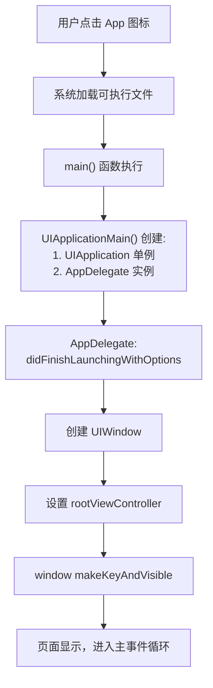

# 第六课：Xcode 工程结构与 iOS App 生命周期

> 从"会写 OC 代码"到"理解一个 iOS App 是怎么运行的"

---

## 1. Xcode 工程结构

打开我们的 OCTodo 项目，左侧文件树是这样的：

```
OCTodo/
├── OCTodo.xcodeproj        ← 项目配置文件（类似 package.json + webpack.config）
└── OCTodo/
    ├── main.m              ← 程序入口（类似 index.html）
    ├── AppDelegate/        ← App 生命周期管理
    │   ├── AppDelegate.h
    │   └── AppDelegate.m
    ├── Controllers/        ← 页面控制器（类似 pages/ 或 views/）
    │   ├── HomeViewController.h
    │   └── HomeViewController.m
    ├── Models/             ← 数据模型（类似 models/ 或 types/）
    │   ├── TodoItem.h
    │   ├── TodoItem.m
    │   ├── TodoItem+Display.h
    │   └── TodoItem+Display.m
    ├── Views/              ← 自定义视图（类似 components/）
    ├── Utils/              ← 工具类（类似 utils/ 或 helpers/）
    │   ├── NSString+Validation.h
    │   └── NSString+Validation.m
    └── Resources/          ← 资源文件（类似 public/ 或 assets/）
        ├── Info.plist
        └── Base.lproj/
            └── LaunchScreen.storyboard
```

### 1.1 关键文件解释

| 文件 | 作用 | Web 对应 |
|------|------|---------|
| `.xcodeproj` | 项目配置：编译选项、文件引用、签名设置 | `package.json` + `webpack.config.js` |
| `main.m` | 程序入口，调用 `UIApplicationMain` 启动 App | `index.html` 中的 `<script>` |
| `Info.plist` | App 元信息：名称、版本、权限声明、启动配置 | `manifest.json` / `<meta>` 标签 |
| `LaunchScreen.storyboard` | 启动屏（App 打开瞬间显示的画面） | 首屏骨架屏 / loading 页 |
| `AppDelegate` | App 级别的生命周期回调 | 全局事件监听器 |

### 1.2 Info.plist 详解

Info.plist 是 App 的"身份证"，告诉系统这个 App 的基本信息：

```xml
<key>CFBundleDisplayName</key>    <!-- App 显示名称（桌面图标下的文字）-->
<string>OCTodo</string>

<key>CFBundleVersion</key>        <!-- 构建版本号 -->
<string>1</string>

<key>CFBundleShortVersionString</key>  <!-- 对外显示的版本号 -->
<string>1.0</string>

<key>UILaunchStoryboardName</key>      <!-- 启动屏 storyboard -->
<string>LaunchScreen</string>

<key>UISupportedInterfaceOrientations</key>  <!-- 支持的屏幕方向 -->
<array>
    <string>UIInterfaceOrientationPortrait</string>  <!-- 仅竖屏 -->
</array>
```

**Web 类比：** 类似 PWA 的 `manifest.json`（名称、图标、方向锁定等）。

### 1.3 Build Settings 核心配置

在 Xcode 中点击项目 → Build Settings，常见配置：

| 配置项 | 含义 | 我们项目的值 |
|--------|------|-------------|
| `IPHONEOS_DEPLOYMENT_TARGET` | 最低支持的 iOS 版本 | 14.0 |
| `CLANG_ENABLE_OBJC_ARC` | 是否启用 ARC | YES |
| `PRODUCT_BUNDLE_IDENTIFIER` | App 唯一标识（全球唯一） | com.practice.OCTodo.zcc |
| `HEADER_SEARCH_PATHS` | 头文件搜索路径 | `$(SRCROOT)/OCTodo/**` |

## 2. iOS App 启动流程

一个 App 从点击图标到显示页面，经历了什么？



**对照我们的代码：**

```objc
// main.m — 第③步
int main(int argc, char * argv[]) {
    @autoreleasepool {
        return UIApplicationMain(argc, argv, nil,
                                 NSStringFromClass([AppDelegate class]));
    }
}

// AppDelegate.m — 第⑤⑥⑦⑧步
- (BOOL)application:(UIApplication *)application
    didFinishLaunchingWithOptions:(NSDictionary *)launchOptions {
    
    self.window = [[UIWindow alloc] initWithFrame:[UIScreen mainScreen].bounds]; // ⑥
    HomeViewController *homeVC = [[HomeViewController alloc] init];
    UINavigationController *nav = [[UINavigationController alloc]
                                   initWithRootViewController:homeVC];
    self.window.rootViewController = nav;  // ⑦
    [self.window makeKeyAndVisible];       // ⑧
    return YES;
}
```

**Web 类比：**
```
浏览器输入 URL → 下载 HTML → 解析 DOM → 执行 JS → DOMContentLoaded → 页面渲染
点击 App 图标 → 加载二进制 → main() → UIApplicationMain → didFinish → 页面显示
```

## 3. App 生命周期（五种状态）

iOS App 有五种运行状态：

| 状态 | 说明 | Web 类比 |
|------|------|---------|
| **Not Running** | 未启动 | 浏览器标签页未打开 |
| **Inactive** | 前台但不接收事件（如来电、下拉通知栏） | 页面可见但被遮挡 |
| **Active** | 前台且正在接收事件 | 页面正常使用中 |
| **Background** | 后台运行（有短暂的执行时间） | 标签页不可见 |
| **Suspended** | 后台挂起（内存中但不执行代码） | 标签页被浏览器冻结 |

### 对应的 AppDelegate 回调方法

```objc
// App 启动完成 → Active
- (BOOL)application:didFinishLaunchingWithOptions:

// Active → Inactive（来电、下拉通知栏）
- (void)applicationWillResignActive:

// Inactive → Background（按 Home 键）
- (void)applicationDidEnterBackground:

// Background → Inactive（从后台回来）
- (void)applicationWillEnterForeground:

// Inactive → Active（恢复交互）
- (void)applicationDidBecomeActive:

// App 即将被系统杀死
- (void)applicationWillTerminate:
```

### 典型场景

| 用户操作 | 触发的回调 | 你应该做什么 |
|---------|-----------|-------------|
| 打开 App | `didFinishLaunching` → `didBecomeActive` | 初始化数据、UI |
| 按 Home 键 | `willResignActive` → `didEnterBackground` | 保存数据、暂停任务 |
| 回到 App | `willEnterForeground` → `didBecomeActive` | 刷新数据、恢复任务 |
| 来电话 | `willResignActive` | 暂停音视频 |
| 挂电话 | `didBecomeActive` | 恢复音视频 |

## 4. UIWindow 与 rootViewController

### 4.1 UIWindow 是什么？

UIWindow 是 App 的"画布"，所有 UI 都画在这个 window 上。

**Web 类比：** `window` 对象 + `<body>` 元素的合体。浏览器帮你创建了 window，但 iOS 里你需要自己创建。

```objc
// 创建窗口
self.window = [[UIWindow alloc] initWithFrame:[UIScreen mainScreen].bounds];

// 设置根控制器（决定窗口上显示什么页面）
self.window.rootViewController = someViewController;

// 让窗口可见
[self.window makeKeyAndVisible];
```

### 4.2 rootViewController

每个 window 必须有一个 rootViewController，它是整个 App 的 UI 起点。

常见的 rootViewController 类型：

| 类型 | 作用 | Web 类比 |
|------|------|---------|
| `UINavigationController` | 导航栈（push/pop 页面） | React Router |
| `UITabBarController` | 底部标签栏（微信那种） | 底部 Tab 导航 |
| 普通 `UIViewController` | 单页面 | 单页面应用 |

我们项目用的是 `UINavigationController`，它提供：
- 顶部导航栏（显示标题、返回按钮）
- 页面栈管理（push 进入新页面，pop 返回上一页）

## 5. SceneDelegate（iOS 13+ 的变化）

iOS 13 开始，Apple 引入了 `SceneDelegate`，将 UI 生命周期从 AppDelegate 中拆出：

| 职责 | iOS 12 及之前 | iOS 13+ |
|------|-------------|---------|
| App 级事件（启动、推送） | AppDelegate | AppDelegate |
| UI 级事件（前后台、窗口） | AppDelegate | **SceneDelegate** |

**我们的项目为什么没有 SceneDelegate？**

因为我们的 deployment target 是 iOS 14，但代码是用传统方式（AppDelegate 管理 window）写的。这种写法更简单、兼容性更好，小项目和学习阶段完全够用。

等后续需要支持 iPad 多窗口或 iOS 的多场景功能时，再引入 SceneDelegate。

## 6. 编译与运行过程

Cmd+R 按下后发生了什么？

| 阶段 | 做什么 | Web 对应 |
|------|--------|---------|
| **预处理** | 展开 `#import`、处理宏定义 | webpack 解析 import |
| **编译** | `.m` → `.o`（目标文件） | babel 编译 .ts → .js |
| **链接** | 多个 `.o` + 系统库 → 可执行文件 | webpack 打包成 bundle |
| **签名** | 给可执行文件加数字签名 | HTTPS 证书 |
| **安装** | 把 `.app` 安装到模拟器/真机 | 部署到服务器 |
| **启动** | 执行 main() 函数 | 浏览器打开页面 |

## 7. 练习

1. iOS App 的入口函数是什么？它和 Web 的入口有什么区别？

2. 用户按 Home 键后，AppDelegate 会依次触发哪两个回调？你应该在里面做什么？

3. 为什么每个 UIWindow 都必须设置 rootViewController？

4. Info.plist 中的 `CFBundleIdentifier` 有什么要求？为什么之前我们遇到了注册失败的问题？

> **答案提示：**
> 1. `main()` 函数，调用 `UIApplicationMain()` 启动 App。Web 没有显式的 main，浏览器自动执行 `<script>`
> 2. `willResignActive` → `didEnterBackground`。应该保存用户数据、暂停进行中的任务
> 3. window 只是一个空画布，必须告诉它"显示什么内容"。没有 rootViewController 窗口就是黑屏
> 4. 必须全球唯一。我们之前用 `com.practice.OCTodo` 被别人注册过了，改成带个人标识的 `com.practice.OCTodo.zcc` 才成功

---

**下一课预告：** 第七课 — UIKit 入门（UIView、UILabel、UIButton）

开始真正"画界面"！理解 iOS 的视图层级和事件响应机制。
