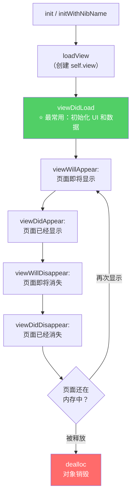

# 第八课：UIViewController 生命周期与职责拆分

> 理解页面从创建到销毁的完整过程，写出结构清晰的页面代码。

---

## 1. 为什么要理解生命周期？

在 Web 里，React 开发者都知道 `componentDidMount` 里做初始化、`componentWillUnmount` 里做清理。iOS 的 UIViewController 有一套类似但更细粒度的生命周期。

**不理解生命周期会踩的坑：**
- 在 `init` 里访问 `self.view` → 触发提前加载，可能崩溃
- 在 `viewDidLoad` 里拿屏幕尺寸 → 拿到的可能不对（view 还没布局）
- 忘记在 `dealloc` 里移除通知 → 内存泄漏或崩溃

## 2. 完整生命周期



## 3. 每个阶段详解

### 3.1 init — 对象创建

```objc
// 代码创建
HomeViewController *vc = [[HomeViewController alloc] init];
// 此时 self.view 还不存在！不要在 init 里访问 self.view
```

**Web 类比：** `constructor()`。组件对象创建了，但还没挂载到 DOM。

### 3.2 viewDidLoad — ⭐ 最重要

```objc
- (void)viewDidLoad {
    [super viewDidLoad]; // 必须调用 super
    
    // ✅ 在这里做的事：
    // 1. 创建和添加子视图
    // 2. 设置约束
    // 3. 初始化数据
    // 4. 绑定事件
}
```

**调用时机：** view 第一次被加载到内存后，**只调用一次**。

**Web 类比：** React 的 `componentDidMount` / `useEffect(() => {}, [])`

**适合做的事：**
| ✅ 做 | ❌ 不做 |
|-------|--------|
| 创建 UI 控件 | 依赖准确的 view 尺寸 |
| 设置 AutoLayout | 启动动画（view 可能还没显示） |
| 加载初始数据 | 每次显示都需要刷新的操作 |

### 3.3 viewWillAppear: — 页面即将显示

```objc
- (void)viewWillAppear:(BOOL)animated {
    [super viewWillAppear:animated];
    
    // ✅ 适合做的事：
    // 1. 刷新数据（从其他页面返回时数据可能变了）
    // 2. 更新 UI 状态
    // 3. 开始监听通知
}
```

**调用时机：** 每次页面即将出现时都会调用（第一次显示、从其他页面返回）。

**Web 类比：** 类似 Vue 的 `activated`（keep-alive 组件重新激活）。

**和 viewDidLoad 的区别：**
- `viewDidLoad`：只执行一次，适合一次性初始化
- `viewWillAppear`：每次显示都执行，适合需要实时刷新的操作

### 3.4 viewDidAppear: — 页面已经显示

```objc
- (void)viewDidAppear:(BOOL)animated {
    [super viewDidAppear:animated];
    
    // ✅ 适合做的事：
    // 1. 开始播放动画
    // 2. 开始定时器
    // 3. 此时 view 的 frame 已经确定，可以安全获取尺寸
}
```

### 3.5 viewWillDisappear: / viewDidDisappear:

```objc
- (void)viewWillDisappear:(BOOL)animated {
    [super viewWillDisappear:animated];
    
    // ✅ 页面即将消失
    // 1. 保存数据
    // 2. 停止定时器
    // 3. 取消未完成的网络请求
}

- (void)viewDidDisappear:(BOOL)animated {
    [super viewDidDisappear:animated];
    // 页面已经完全不可见
}
```

**Web 类比：** React 的 `componentWillUnmount` / `useEffect` 的清理函数。但注意 disappear ≠ 销毁，页面可能只是被新页面覆盖了。

### 3.6 dealloc — 对象销毁

```objc
- (void)dealloc {
    // 移除通知监听
    [[NSNotificationCenter defaultCenter] removeObserver:self];
    NSLog(@"♻️ HomeViewController 被释放了");
}
```

**调用时机：** 引用计数为 0，对象被销毁。

## 4. 对照 React 生命周期

| UIViewController | React Class | React Hooks |
|-----------------|-------------|-------------|
| `init` | `constructor()` | 函数组件本身 |
| `viewDidLoad` | `componentDidMount` | `useEffect(() => {}, [])` |
| `viewWillAppear` | — (无直接对应) | 自定义 `useFocusEffect` |
| `viewDidAppear` | — | — |
| `viewWillDisappear` | — | — |
| `viewDidDisappear` | `componentWillUnmount` (部分) | `useEffect` return cleanup |
| `dealloc` | `componentWillUnmount` | `useEffect` return cleanup |

**核心区别：** React 组件销毁就是销毁，iOS 页面 disappear 不等于 dealloc。push 一个新页面后，旧页面还在内存中（导航栈里），返回时触发 `viewWillAppear` 而不是 `viewDidLoad`。

## 5. 实战验证：加日志看执行顺序

我们在 HomeViewController 中加上所有生命周期方法的日志，在 Xcode 控制台中观察它们的执行顺序。

## 6. 职责拆分：用 #pragma mark 组织代码

当一个 ViewController 代码变多时，用 `#pragma mark` 分区：

```objc
#pragma mark - 生命周期
- (void)viewDidLoad { ... }
- (void)viewWillAppear:(BOOL)animated { ... }

#pragma mark - UI 搭建
- (void)setupUI { ... }

#pragma mark - 数据
- (void)setupData { ... }
- (void)refreshUI { ... }

#pragma mark - 事件处理
- (void)addButtonTapped { ... }

#pragma mark - 网络请求（后续课程）
```

**效果：** Xcode 顶部的方法导航栏会显示这些分区标题，点击可快速跳转。

**Web 类比：** 类似 JS 文件中用注释 `// ===== Event Handlers =====` 分区，但 `#pragma mark` 有 IDE 级别的支持。

## 7. ViewController 瘦身原则

一个常见问题是 ViewController 越写越胖（几千行）。拆分策略：

| 职责 | 应该放在哪里 | 示例 |
|------|------------|------|
| 数据模型 | Model 类 | `TodoItem` |
| 展示逻辑 | Model+Category 或 View | `TodoItem+Display` |
| 网络请求 | 独立的 Manager/Service | `TodoService`（后续课程） |
| 复杂视图 | 自定义 UIView 子类 | `TodoInputView`（后续课程） |
| 页面逻辑 | ViewController | 生命周期、事件绑定、协调 |

**ViewController 只负责"协调"：** 它连接 Model、View 和用户操作，自身不做重活。

## 8. 练习

1. `viewDidLoad` 和 `viewWillAppear` 的调用次数有什么不同？各适合做什么？

2. 从 A 页面 push 到 B 页面，再从 B 返回 A，A 的哪些生命周期方法会被再次调用？

3. 如果一个页面 pop 后 `dealloc` 没有打印，最可能的原因是什么？

4. 为什么不建议在 `viewDidLoad` 中获取 `self.view.frame.size.width` 来做布局计算？

> **答案提示：**
> 1. `viewDidLoad` 只调用一次（view 首次加载），适合一次性初始化；`viewWillAppear` 每次页面显示都调用，适合刷新数据
> 2. `viewWillAppear:` → `viewDidAppear:`。不会再调 `viewDidLoad`（view 一直在内存中）
> 3. 循环引用导致引用计数 > 0，对象无法释放。检查 Block 是否捕获了 self、delegate 是否用了 strong
> 4. 在 `viewDidLoad` 时，view 可能还没有完成布局，frame 不一定是最终值。如果需要准确尺寸，应该在 `viewDidLayoutSubviews` 或 `viewDidAppear` 中获取

---

**下一课预告：** 第九课 — AutoLayout 实战布局

告别硬编码坐标，用约束系统实现自适应布局。
